# 🎮 Video Game Sales Analysis for the Ice Store

## 📌 Project Description

**Context:**
Ice is an online store that sells video games globally. The company aims to understand which factors influence the success of a video game to optimize its advertising campaigns and sales strategies.

**Analysis Objective:**
To identify patterns in historical video game data—including user and critic reviews, genres, platforms, and sales by region—that allow predicting whether a video game will be successful.

## 🧠 Objective

- Analyze sales and review data.
- Determine which platforms and genres are most profitable.
- Evaluate the impact of reviews and ESRB ratings on sales.
- Formulate and test statistical hypotheses.

---

## 📁 Dataset

- Source: `/datasets/games.csv`
- Main Columns:
  - `name`: Video game name
  - `platform`: Platform (Xbox, PS, etc.)
  - `year_of_release`: Release year
  - `genre`: Genre
  - `na_sales`, `eu_sales`, `jp_sales`, `other_sales`: Sales by region (in million USD)
  - `critic_score`: Critic score (0-100)
  - `user_score`: User score (0-10)
  - `rating`: ESRB rating

---

## 🧹 Data Preparation

- Conversion of data types (e.g., dates and ratings).
- Cleaning of missing values and "TBD" values.
- Calculation of total sales per console (`total_sales`).

📊 Result:

  

---

## 📊 Exploratory Data Analysis

### Games by Year
Visualizing the number of games released per year to determine significant periods.

  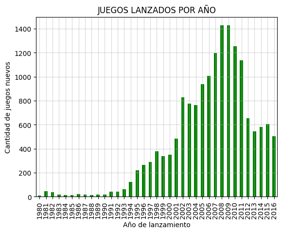

### Most Popular Platforms
Identifying platforms with the highest total sales, observing their life cycle.

  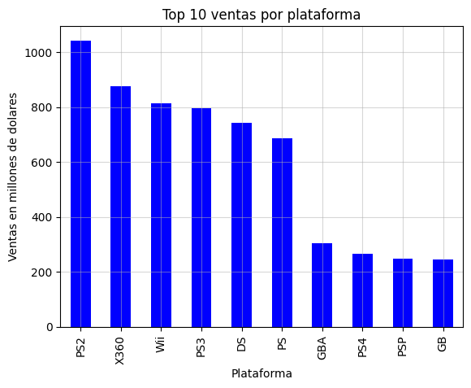
  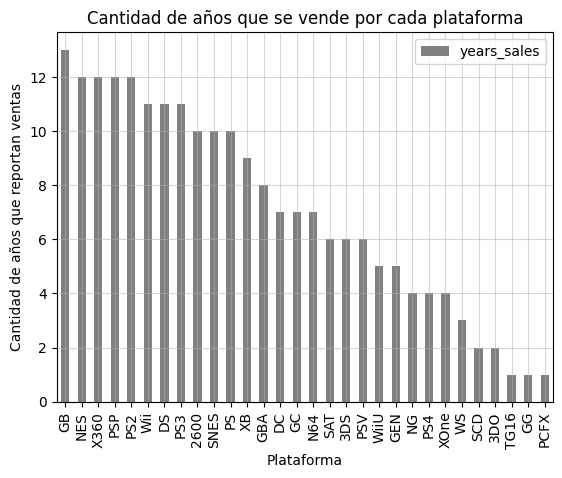

### Global Sales Boxplot

  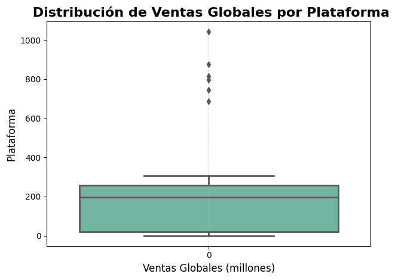

---

## 💬 Review Analysis

Exploring the correlation between user and critic scores vs. sales, using **PS4** as an example.

  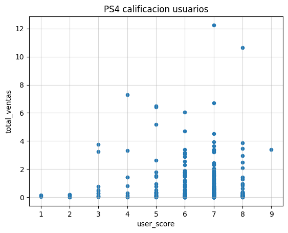
  

---

## 🎯 Analysis by Region

### North America, Europe, and Japan
---
- Top 5 platforms and genres.

  
  
  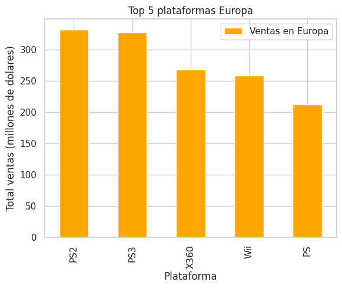

---
- Preferences by region.

  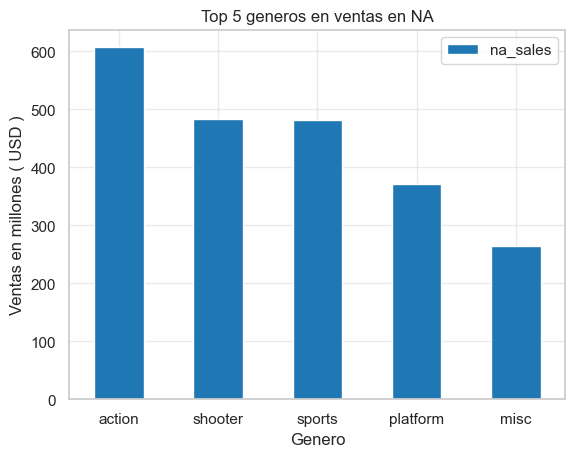
  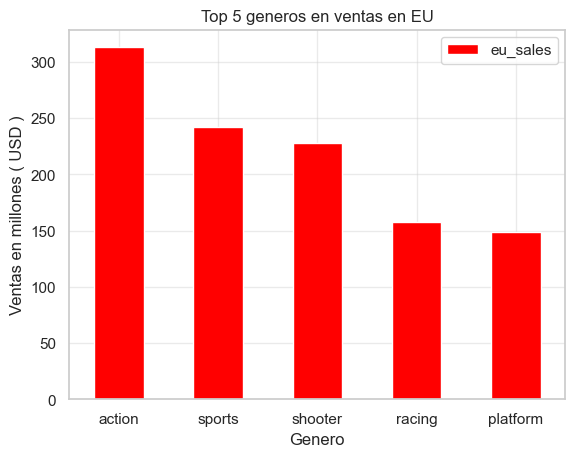
  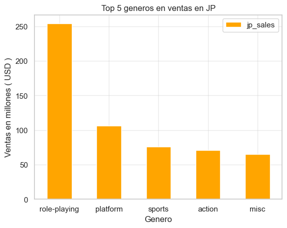

---
- Influence of ESRB.

  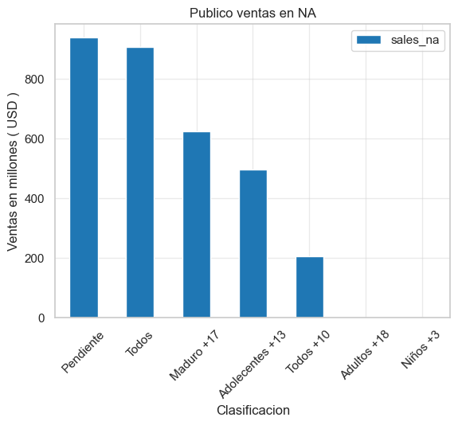
  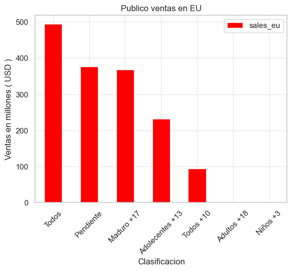
  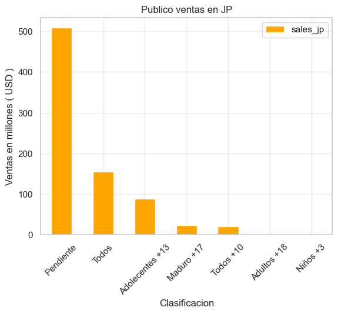

## 🧪 Hypothesis Testing

The following hypotheses were tested:

1.  Average user ratings for Xbox One and PC are different.
2.  Average user ratings for the Action and Sports genres are the same.

Method: Student's t-test with a significance level of `α = 0.05`.

  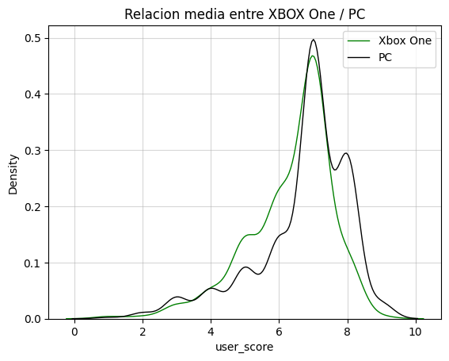
  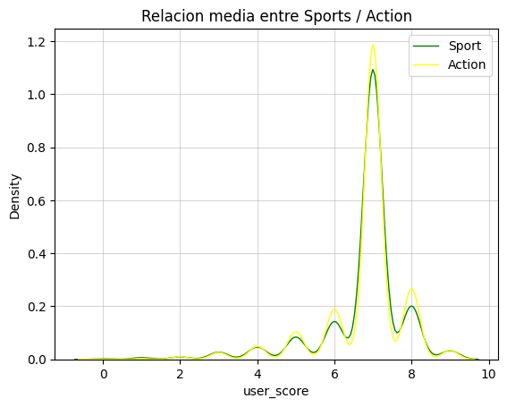

---

## 🛠 Used Technologies

- Python (Pandas, Matplotlib, Seaborn, SciPy)
- Jupyter Notebook
- Git and GitHub
- Inferential Statistics (hypothesis testing)

---

## 📌 Conclusions

- The report recommends maintaining a good stock of PS4 and Xbox One games due to their current trend and estimated lifespan. It suggests monitoring platform trends every decade, learning from Nintendo's loss of leadership in the 2000s.

- It also highlights the importance of expert reviews, influencer marketing, and attention to games in Esports. Franchises like Call of Duty and GTA remain relevant, as does the shooter genre thanks to online gaming.

- Regional analysis reveals similar preferences between Europe and North America for action and sports (with Xbox stronger in NA and PlayStation in Europe), while Japan prefers Nintendo games and RPGs.

- Finally, the report emphasizes the need to complete information about the target audience of the games to improve the accuracy of the analysis.

---

