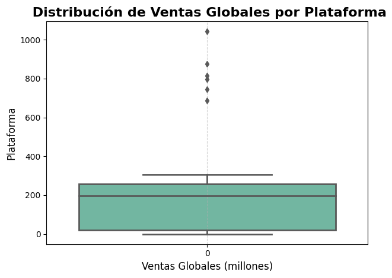
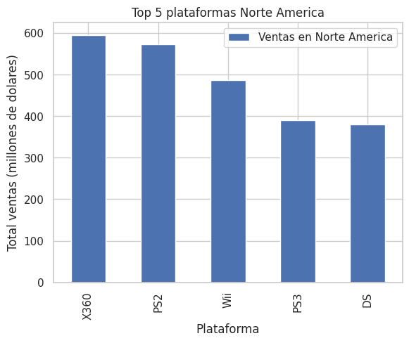
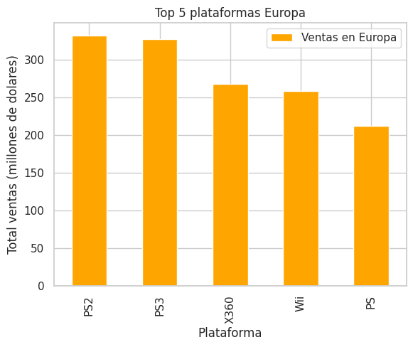
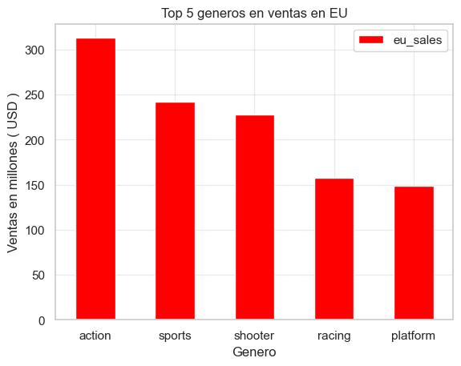
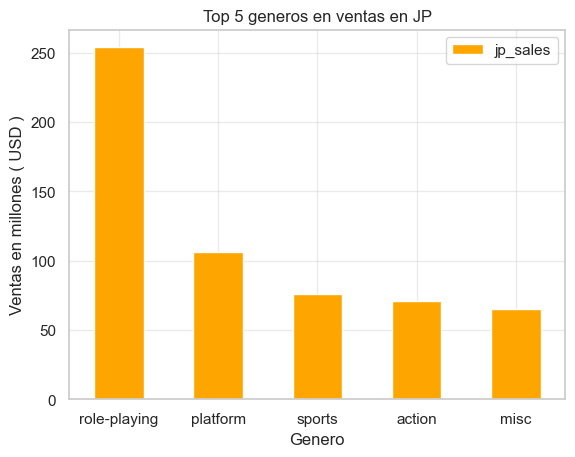
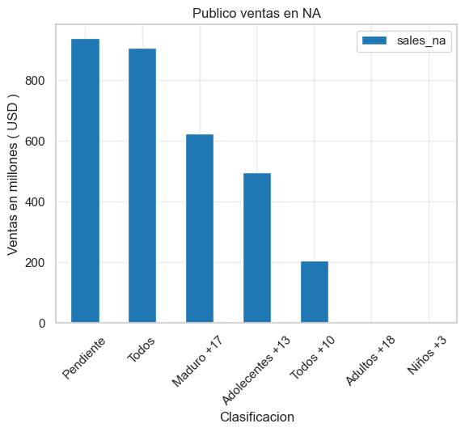
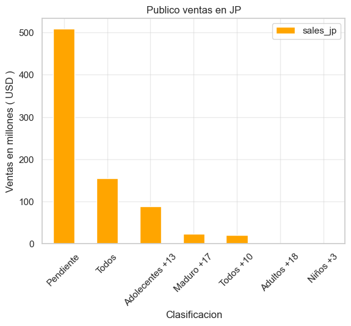
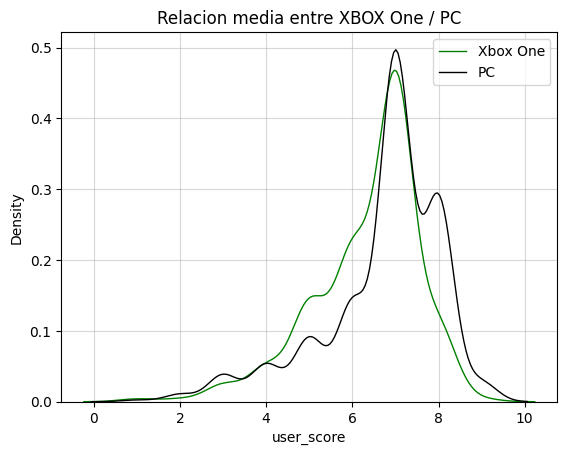
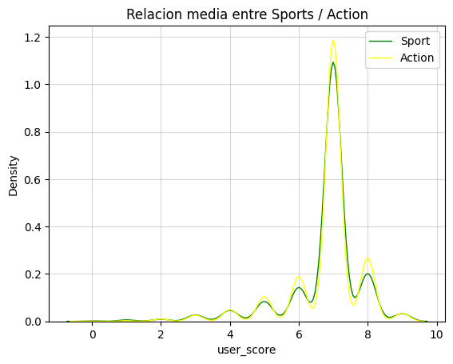

#  An谩lisis de Ventas de Videojuegos para la Tienda Ice

##  Descripci贸n del Proyecto

Trabajas como analista de datos para **Ice**, una tienda online que vende videojuegos en todo el mundo. Contamos con datos hist贸ricos hasta 2016, incluyendo rese帽as de usuarios y cr铆ticos, g茅neros, plataformas y ventas por regi贸n. El objetivo es **identificar patrones que determinen si un videojuego ser谩 exitoso**, para as铆 planificar campa帽as publicitarias efectivas para el a帽o siguiente (2017).

##  Objetivo

- Analizar los datos de ventas y rese帽as.
- Determinar qu茅 plataformas y g茅neros son m谩s rentables.
- Evaluar el impacto de las rese帽as y calificaciones ESRB en las ventas.
- Formular y comprobar hip贸tesis estad铆sticas.

---

##  Dataset

- Fuente: `/datasets/games.csv`
- Columnas principales:
  - `name`: Nombre del videojuego
  - `platform`: Plataforma (Xbox, PS, etc.)
  - `year_of_release`: A帽o de lanzamiento
  - `genre`: G茅nero
  - `na_sales`, `eu_sales`, `jp_sales`, `other_sales`: Ventas por regi贸n (en millones USD)
  - `critic_score`: Calificaci贸n de cr铆ticos (0-100)
  - `user_score`: Calificaci贸n de usuarios (0-10)
  - `rating`: Clasificaci贸n ESRB

---

## Ч Preparaci贸n de los Datos

- Conversi贸n de tipos de datos (por ejemplo, fechas y calificaciones).
- Limpieza de valores nulos y valores "TBD".
- C谩lculo de ventas totales por consola (`total_sales`).

 Resultado:

---

##  An谩lisis Exploratorio

### Juegos por A帽o
Se visualiza la cantidad de juegos publicados por a帽o para determinar qu茅 periodos son significativos.

### Plataformas m谩s Populares
Identificamos las plataformas con mayores ventas totales, observando su ciclo de vida.

  
  

### Diagrama de Caja de Ventas Globales

---

##  An谩lisis de Rese帽as

Se explora la correlaci贸n entre calificaciones de usuarios y cr铆ticos vs. ventas, usando como ejemplo **PS4**.

  
  

---

##  An谩lisis por Regi贸n

### Am茅rica del Norte, Europa y Jap贸n
---
- Top 5 plataformas y g茅neros.

  
  
  
---
- Preferencias por regi贸n.

---
- Influencia del ESRB.

## И Pruebas de Hip贸tesis

Se probaron las siguientes hip贸tesis:

1. Las calificaciones promedio de usuarios para Xbox One y PC son diferentes.
2. Las calificaciones promedio de usuarios para los g茅neros Acci贸n y Deportes son iguales.

M茅todo: Prueba t de Student con un nivel de significancia `伪 = 0.05`.

  

---

##  Conclusiones

- El informe recomienda mantener un buen stock de juegos de PS4 y Xbox One por su tendencia actual y vida 煤til estimada. Se sugiere monitorear las tendencias de plataformas cada d茅cada, aprender de la p茅rdida de liderazgo de Nintendo en los 2000.

- Tambi茅n destaca la importancia de la cr铆tica de expertos, el marketing con influencers y la atenci贸n a los juegos en  Esports. Franquicias como Call of Duty y GTA siguen siendo relevantes, al igual que el g茅nero shooter gracias al juego online.

- El an谩lisis regional revela preferencias similares entre Europa y Norteam茅rica por acci贸n y deportes (con Xbox m谩s fuerte en NA y PlayStation en Europa), mientras que Jap贸n prefiere juegos de Nintendo y RPGs.

- Finalmente, el informe enfatiza la necesidad de completar la informaci贸n sobre el p煤blico objetivo de los juegos para mejorar la precisi贸n del an谩lisis.

---

##  Tecnolog铆as Usadas

- Python (Pandas, Matplotlib, Seaborn, SciPy)
- Jupyter Notebook
- Git y GitHub
- Estad铆stica inferencial (prueba de hip贸tesis)

