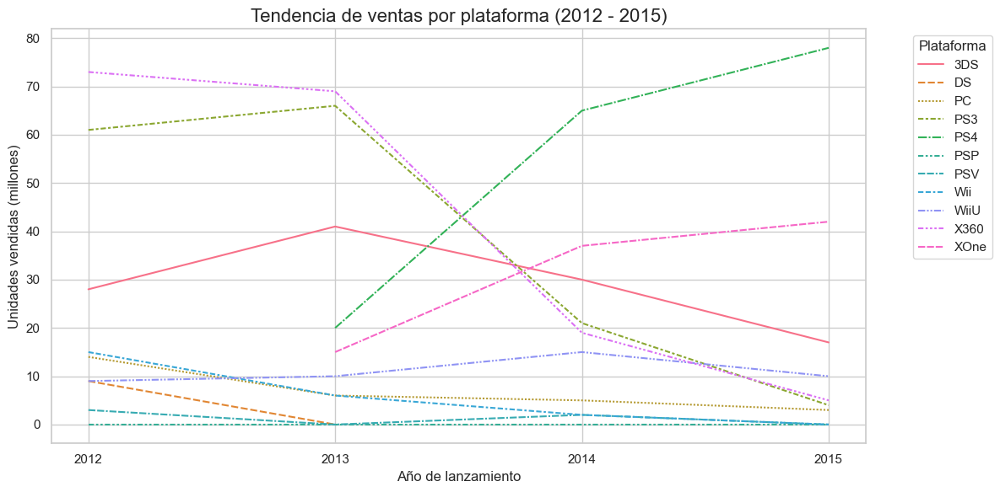
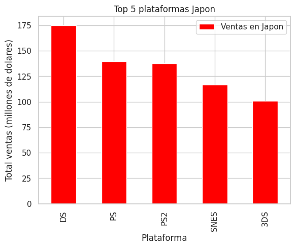

# 🎮 Análisis de Ventas de Videojuegos para la Tienda Ice

## 📌 Descripción del Proyecto

Trabajas como analista de datos para **Ice**, una tienda online que vende videojuegos en todo el mundo. Contamos con datos históricos hasta 2016, incluyendo reseñas de usuarios y críticos, géneros, plataformas y ventas por región. El objetivo es **identificar patrones que determinen si un videojuego será exitoso**, para así planificar campañas publicitarias efectivas para el año siguiente (2017).

## 🧠 Objetivo

- Analizar los datos de ventas y reseñas.
- Determinar qué plataformas y géneros son más rentables.
- Evaluar el impacto de las reseñas y calificaciones ESRB en las ventas.
- Formular y comprobar hipótesis estadísticas.

---

## 📁 Dataset

- Fuente: `/datasets/games.csv`
- Columnas principales:
  - `name`: Nombre del videojuego
  - `platform`: Plataforma (Xbox, PS, etc.)
  - `year_of_release`: Año de lanzamiento
  - `genre`: Género
  - `na_sales`, `eu_sales`, `jp_sales`, `other_sales`: Ventas por región (en millones USD)
  - `critic_score`: Calificación de críticos (0-100)
  - `user_score`: Calificación de usuarios (0-10)
  - `rating`: Clasificación ESRB

---

## 🧹 Preparación de los Datos

- Conversión de tipos de datos (por ejemplo, fechas y calificaciones).
- Limpieza de valores nulos y valores "TBD".
- Cálculo de ventas totales por juego (`total_sales`).

📊 Resultado:

---

## 📊 Análisis Exploratorio

### Juegos por Año
Se visualiza la cantidad de juegos publicados por año para determinar qué periodos son significativos.

### Plataformas más Populares
Identificamos las plataformas con mayores ventas totales, observando su ciclo de vida.

  

### Diagrama de Caja de Ventas Globales

---

## 💬 Análisis de Reseñas

Se explora la correlación entre calificaciones de usuarios y críticos vs. ventas, usando como ejemplo **PS4**.

  

---

## 🎯 Análisis por Región

### América del Norte, Europa y Japón

- Top 5 plataformas y géneros.
- Preferencias por región.
- Influencia del ESRB.

  
  
  
  

---

## 🧪 Pruebas de Hipótesis

Se probaron las siguientes hipótesis:

1. Las calificaciones promedio de usuarios para Xbox One y PC son diferentes.
2. Las calificaciones promedio de usuarios para los géneros Acción y Deportes son iguales.

Método: Prueba t de Student con un nivel de significancia `α = 0.05`.

  

---

## 📌 Conclusiones

- Las plataformas con mayores ventas históricas fueron **PS4, Xbox One y 3DS**.
- **PS4 y Xbox One** mostraron buen desempeño en reseñas, pero los géneros **Shooter** y **Sports** fueron más volátiles.
- Las preferencias regionales varían significativamente, siendo Japón más orientado al mercado portátil (Nintendo) y con menor influencia de ESRB.
- Las hipótesis estadísticas permitieron validar diferencias clave en las calificaciones y preferencias.

---

## 🛠 Tecnologías Usadas

- Python (Pandas, Matplotlib, Seaborn, SciPy)
- Jupyter Notebook
- Git y GitHub
- Estadística inferencial (prueba de hipótesis)

---

## 📂 Estructura del Proyecto

